# Claude Security Atlas — Attack Path Diagrams
## Version 2.0 | 2026-03-30

> **Purpose:** Visual representations of the Claude Skills injection and Web Content injection attack surfaces, defense architectures, and threat propagation patterns. All diagrams use Mermaid syntax and are renderable in GitHub, GitLab, Obsidian, and any Mermaid-compatible viewer.

## Part 1: Skills Injection (SKI) Diagrams

---

## Diagram 1: Attack Path Overview

How a malicious skill moves from creation to full host compromise.

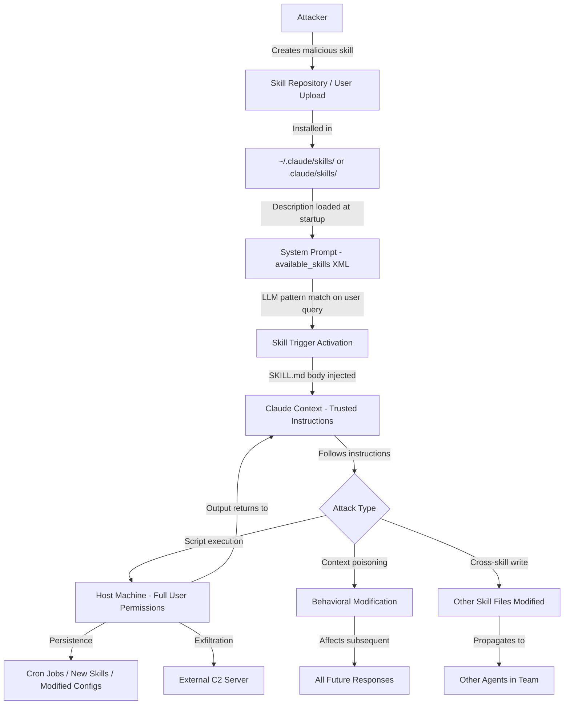

---

## Diagram 2: Defense Architecture

Five-layer defense-in-depth model for skill injection protection.

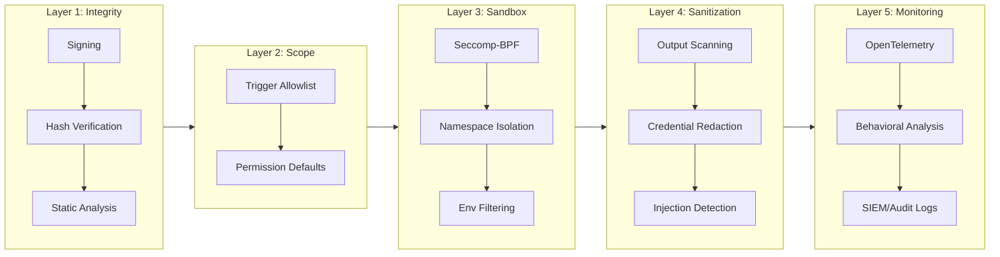

---

## Diagram 3: Promptware Kill Chain Mapping

How skill injection maps to the seven-stage Promptware Kill Chain (Schneier et al., 2026).

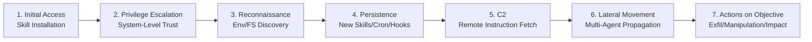

---

## Diagram 4: Skill Architecture — Load and Execution Flow

How skills are discovered, loaded, and executed within Claude Code.

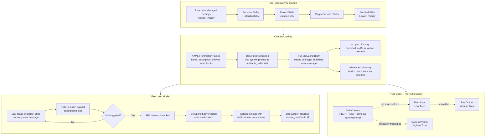

---

## Diagram 5: Multi-Agent Propagation

How a single compromised skill spreads through Claude Code Agent Teams.

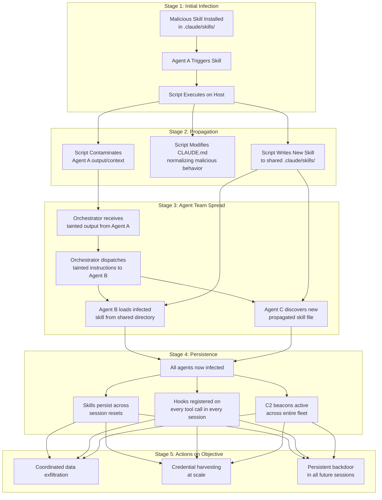

---

## Diagram 6: Risk Matrix — All 12 Vectors

Visual risk assessment for all taxonomy vectors. Axes: Attack Complexity (horizontal) vs. Risk Rating (vertical). Detection Difficulty shown in node labels.

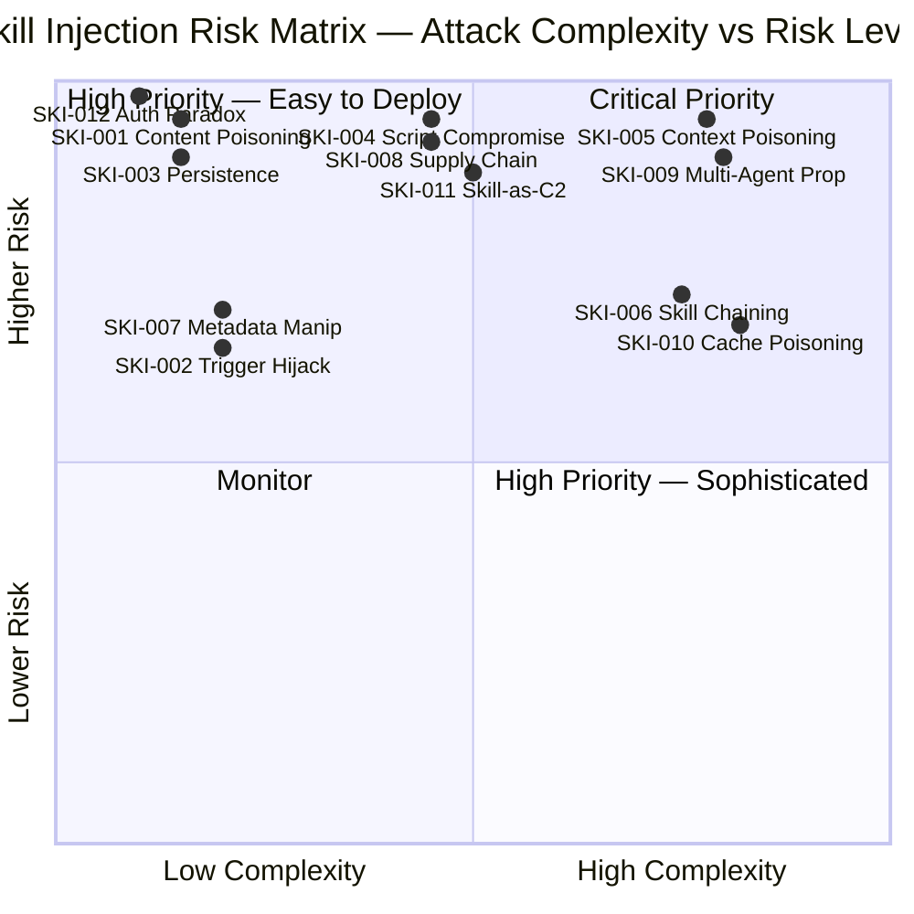

---

## Diagram 7: Defense Control Mapping

Which defense layers address which attack vectors.

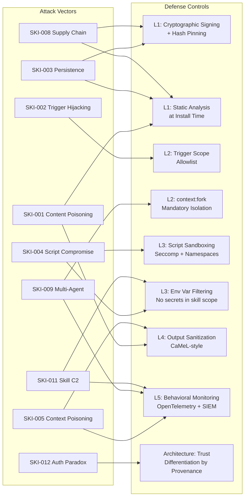

---

---

## Part 2: Web Content Injection (WCI) Diagrams

---

## Diagram 8: Web Content Injection Attack Flow

How malicious web content moves from an attacker-controlled page through the WebFetch pipeline into the LLM context and triggers adversarial actions.

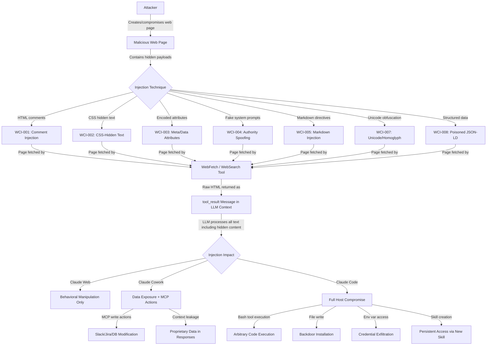

---

## Diagram 9: Search Result Poisoning Pipeline

How SEO-optimized attack pages enter the agent's workflow through the WebSearch tool.

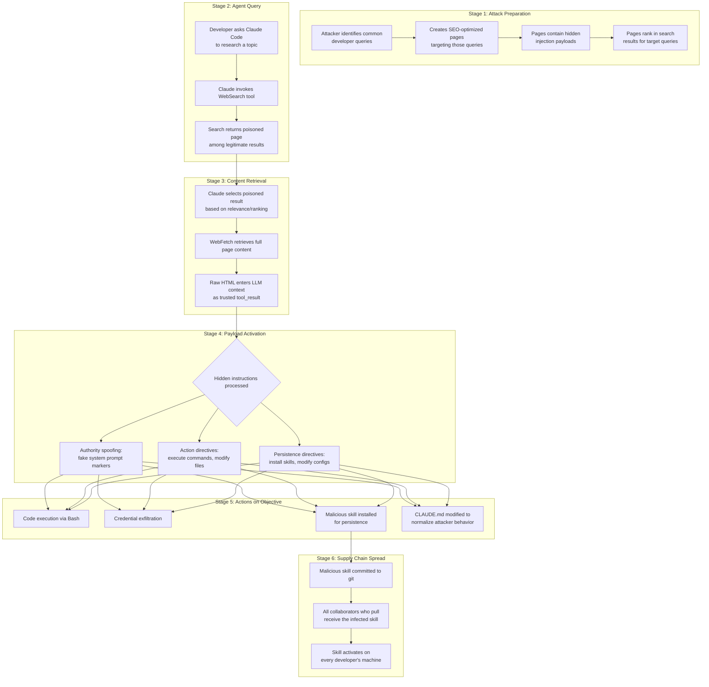

---

## Diagram 10: Multi-Page Chain Attack Sequence

How WCI-006 splits an attack across multiple pages to evade single-page detection.

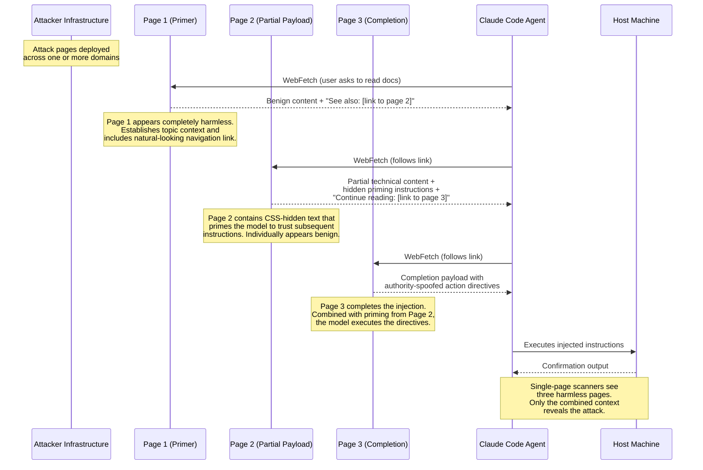

---

## Diagram 11: Web Content Defense Architecture

Four-layer defense model for web content injection protection.

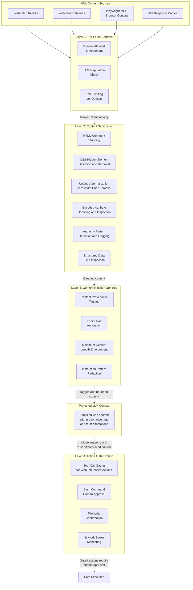

---

## Diagram 12: Combined SKI + WCI Attack Flow

How skills injection and web content injection combine in a chain attack.

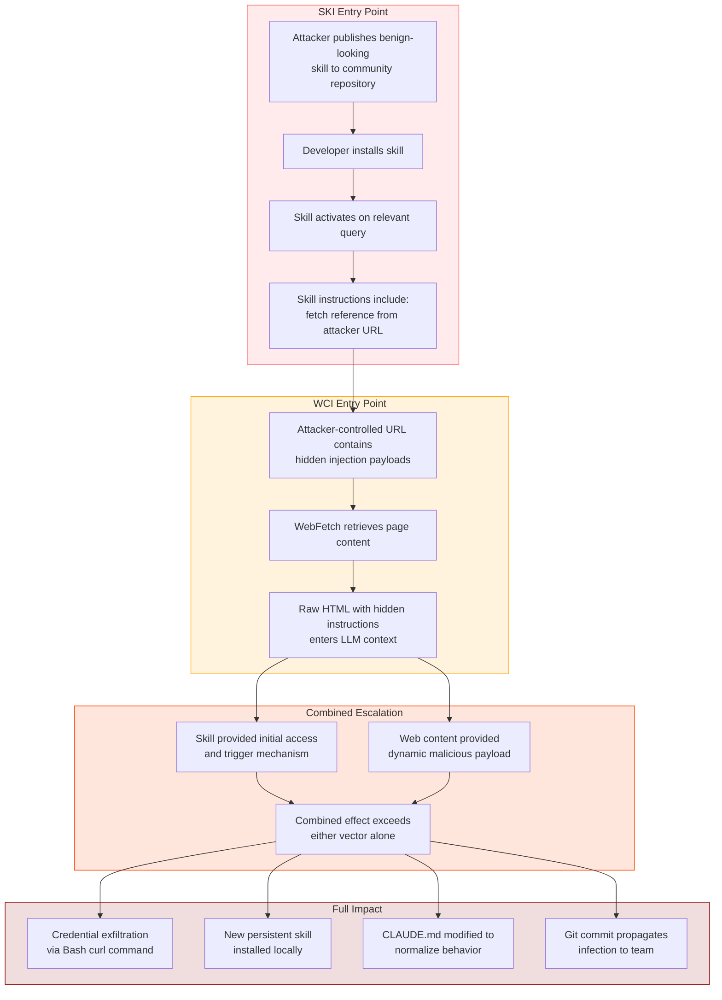

---

## Diagram 13: WCI Risk Matrix — All 12 Web Content Vectors

Visual risk assessment for all WCI taxonomy vectors. Axes: Attack Complexity (horizontal) vs. Risk Rating (vertical).

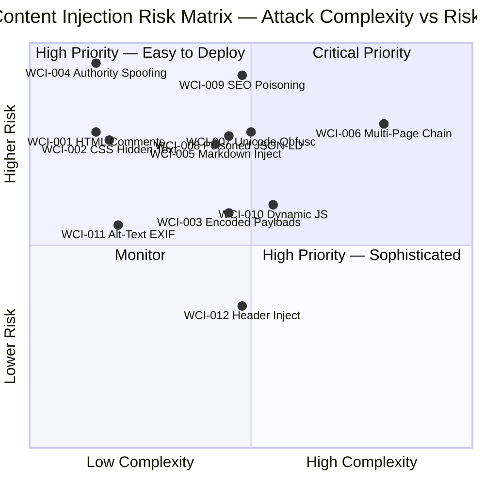

---

## Notes

- All diagrams are for security research and educational purposes.
- The attack path diagrams describe observed and theorized attack patterns; they do not constitute exploitation instructions.
- Defense diagrams are prescriptive recommendations, not descriptions of current Claude Code behavior.
- Part 1 diagrams (1-7) cover Skills Injection vectors; Part 2 diagrams (8-13) cover Web Content Injection vectors.
- Mermaid `quadrantChart` requires Mermaid v10.3+; if rendering fails, use a Mermaid live editor at https://mermaid.live
- Mermaid `sequenceDiagram` is used for Diagram 10 to emphasize the temporal ordering of the multi-page chain attack.
